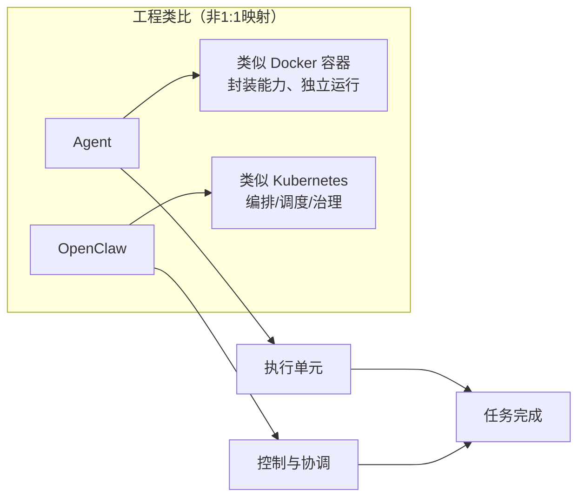
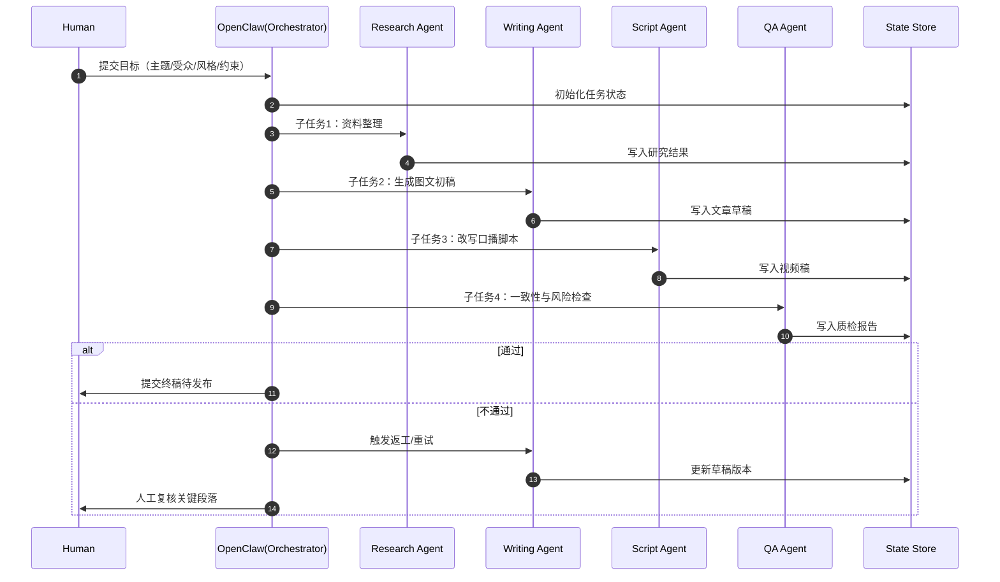
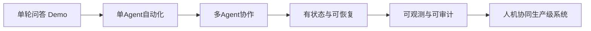

# OpenClaw 到底是什么？把它看成 AI 时代的“K8S”就懂了（HAT 深度版）

> 核心观点：**OpenClaw 更像 AI Agent 世界里的 Kubernetes，Agent 更像容器化执行单元（Docker）。**

很多人对 AI Agent 的理解停留在“会自动跑任务”。
但真正决定系统上限的，不是某个 Agent 有多聪明，而是：

- 多个 Agent 如何协同
- 任务如何被编排和调度
- 状态如何管理
- 失败如何恢复
- 人类如何接管与审计

这恰恰是 OpenClaw 这类框架的核心价值。

---

## 一句话理解

**Agent 是“干活的人”，OpenClaw 是“管理这些人、分配任务、监控过程、处理故障”的操作系统。**

如果用云原生比喻：
- Agent ≈ Docker（封装能力、独立运行）
- OpenClaw ≈ Kubernetes（编排、调度、伸缩、治理）

> 注意：这是工程类比，不是 1:1 映射。

---

## 图 1：K8S 类比图（GitHub 可直接渲染）



---

## 为什么这个类比成立？

在单 Agent 场景，流程可能只是输入 -> 输出。
但真实业务往往是：

- 一个任务拆成多个子任务
- 不同 Agent 分工（检索、推理、写作、质检）
- 多工具接入（文件、数据库、API、浏览器）
- 长流程状态跟踪（中断恢复、重试、回滚）

这时你需要的已经不是“更强模型”，而是“**更强编排系统**”。

---

## OpenClaw 底层原理架构（核心）

你可以用“四平面”理解：

### 1）控制平面（Control Plane）——指挥系统
- 任务解析器：Goal -> DAG/步骤图
- 编排器：管理依赖与顺序
- 调度器：子任务分配
- 策略引擎：权限、预算、风险边界

### 2）执行平面（Execution Plane）——生产系统
- Agent Runtime：执行单元运行时
- Tool Adapter：接外部工具/API/DB
- Model Gateway：模型路由与成本控制
- Worker Pool：并发执行与隔离

### 3）状态平面（State Plane）——记忆与恢复
- 短期上下文
- 长期记忆（向量库/知识库）
- 任务状态机（Pending/Running/Failed/Succeeded）
- Checkpoint（断点续跑）

### 4）观测与治理平面（Observability & Governance）——可控与审计
- Tracing（链路追踪）
- Metrics（成功率/延迟/成本）
- Logs/Audit（日志审计）
- Human-in-the-loop（人工审批/接管）

---

## 图 2：总体架构图（推荐主图）

```mermaid
flowchart TB
    U[用户/业务目标] --> CP

    subgraph CP[控制平面 Control Plane]
      P1[任务解析器\nGoal -> Task Graph]
      P2[编排器\nDAG/依赖管理]
      P3[调度器\n任务分发/负载均衡]
      P4[策略引擎\n权限/预算/风险策略]
      P1 --> P2 --> P3 --> P4
    end

    CP --> EP

    subgraph EP[执行平面 Execution Plane]
      E1[Agent Runtime A\n(Research)]
      E2[Agent Runtime B\n(Writing)]
      E3[Agent Runtime C\n(QA)]
      E4[Worker Pool\n并发执行]
      E5[Model Gateway\n模型路由/成本控制]
      E6[Tool Adapter\n文件/API/DB/浏览器]
      E1 --> E4
      E2 --> E4
      E3 --> E4
      E4 --> E5
      E4 --> E6
    end

    EP --> SP

    subgraph SP[状态平面 State Plane]
      S1[短期上下文\nSession Memory]
      S2[长期记忆\nVector/Knowledge Base]
      S3[任务状态机\nPending/Running/Failed/Succeeded]
      S4[Checkpoint\n断点续跑]
      S1 --- S2
      S2 --- S3
      S3 --- S4
    end

    CP -.读写状态.-> SP
    EP -.读写状态.-> SP

    subgraph OG[观测与治理 Observability & Governance]
      O1[Tracing\n链路追踪]
      O2[Metrics\n成功率/延迟/成本]
      O3[Logs/Audit\n日志与审计]
      O4[Human-in-the-loop\n人工审批/接管]
    end

    CP --> OG
    EP --> OG
    SP --> OG

    OG --> R[最终产出\n文章/脚本/API结果]
```

---

## 关键机制：OpenClaw 如何像 K8S 一样“管得住”

1. **声明式目标（Declarative Goal）**：声明要什么，系统决定怎么做。  
2. **Reconcile 循环**：持续对比期望状态与实际状态。  
3. **调度与弹性**：高峰扩容、低峰回收。  
4. **失败重试与降级**：超时、失败、异常都有兜底策略。  
5. **权限边界**：最小权限原则，避免 Agent 越权。

---

## 图 3：任务执行时序图（公众号 + 视频）



---

## HAT 视角：为什么这套架构重要？

Human-AI Teaming 的重点不是“让 AI 自由发挥”，而是“**在可治理框架内发挥**”。

- **人类**：目标定义、边界设定、价值判断、最终批准
- **OpenClaw**：任务编排、资源调度、状态管理、过程治理
- **Agent**：具体执行（检索/生成/验证/改写）

所以 OpenClaw 不是“会写文案的机器人”，而是人机协作系统的基础设施。

---

## 图 4：从 Demo 到 Production 的能力阶梯



---

## 结语

在 AI 工程里：
**Agent 决定“能做什么”，OpenClaw 决定“能不能稳定地做成”。**

从这个角度看，OpenClaw 像 AI 世界的 Kubernetes：
它不是替代人，而是让“人 + 多 Agent”的协作第一次具备工程级可控性。

---

## 备选标题
1. OpenClaw 是 AI 的 K8S 吗？一文看懂底层架构
2. Agent 像 Docker，OpenClaw 像 Kubernetes？这个比喻太重要了
3. 从“会聊天”到“会执行”：OpenClaw 的工程真相
