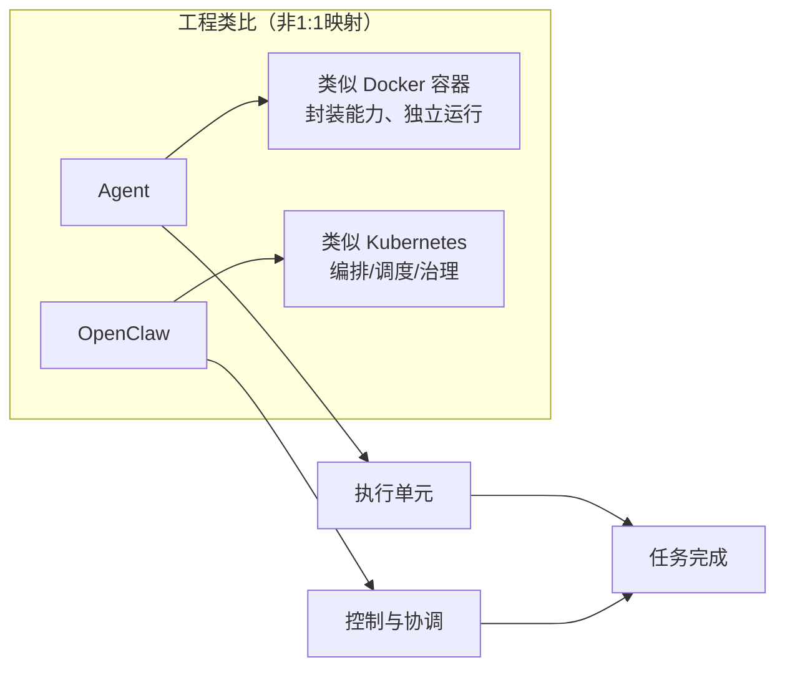
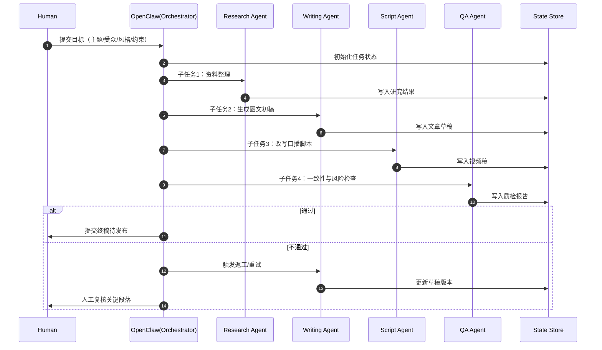
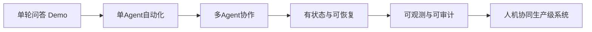

# OpenClaw 架构配图（GitHub 可直接渲染）

> 说明：本文件使用 **Mermaid** 语法，GitHub（仓库页面/README/Markdown预览）可直接渲染为图。你可把这些图块直接复制到公众号草稿或静态站点内容中。

---

## 1) 总体架构图（推荐主图）

```mermaid
flowchart TB
    U[用户/业务目标] --> CP

    subgraph CP[控制平面 Control Plane]
      P1[任务解析器\nGoal -> Task Graph]
      P2[编排器\nDAG/依赖管理]
      P3[调度器\n任务分发/负载均衡]
      P4[策略引擎\n权限/预算/风险策略]
      P1 --> P2 --> P3 --> P4
    end

    CP --> EP

    subgraph EP[执行平面 Execution Plane]
      E1[Agent Runtime A\n(Research)]
      E2[Agent Runtime B\n(Writing)]
      E3[Agent Runtime C\n(QA)]
      E4[Worker Pool\n并发执行]
      E5[Model Gateway\n模型路由/成本控制]
      E6[Tool Adapter\n文件/API/DB/浏览器]
      E1 --> E4
      E2 --> E4
      E3 --> E4
      E4 --> E5
      E4 --> E6
    end

    EP --> SP

    subgraph SP[状态平面 State Plane]
      S1[短期上下文\nSession Memory]
      S2[长期记忆\nVector/Knowledge Base]
      S3[任务状态机\nPending/Running/Failed/Succeeded]
      S4[Checkpoint\n断点续跑]
      S1 --- S2
      S2 --- S3
      S3 --- S4
    end

    CP -.读写状态.-> SP
    EP -.读写状态.-> SP

    subgraph OG[观测与治理 Observability & Governance]
      O1[Tracing\n链路追踪]
      O2[Metrics\n成功率/延迟/成本]
      O3[Logs/Audit\n日志与审计]
      O4[Human-in-the-loop\n人工审批/接管]
    end

    CP --> OG
    EP --> OG
    SP --> OG

    OG --> R[最终产出\n文章/脚本/API结果]
```

---

## 2) K8S 类比图（用于解释）



---

## 3) 任务执行时序图（公众号+视频场景）



---

## 4) 从 Demo 到 Production 的能力阶梯图



---

## 5) 你可以直接放到文章里的配图说明（可复制）

- 图1（主图）：OpenClaw 四平面架构（控制/执行/状态/治理）
- 图2（解释图）：Agent≈Docker，OpenClaw≈K8S（工程类比）
- 图3（流程图）：HAT 内容生产任务时序
- 图4（演进图）：从 Demo 到 Production

---

## 6) GitHub 发布小提示

1. 在 `.md` 中保留 ```mermaid 代码块即可。
2. GitHub 仓库页面可直接渲染 Mermaid。
3. 若你使用 GitHub Pages 的静态站点生成器，确保主题/渲染链支持 Mermaid（如 MkDocs Material、Docusaurus、部分 Jekyll 插件方案）。

---

## 7) 可选：文中引用语句

> Agent 决定“能做什么”，OpenClaw 决定“能不能稳定做成”。

> 真正的生产级 AI，不是模型堆料，而是编排、状态与治理能力的系统化。
